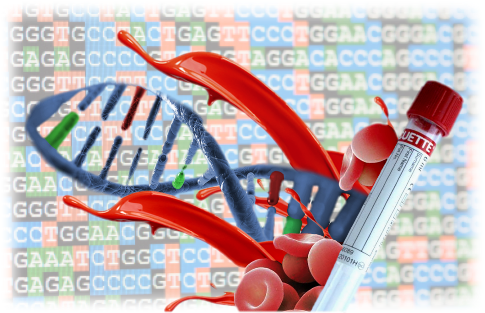

<h3 align="center">
Interactive Frontend - Milestone Project 2 -Bioinformatics Immunology Lab - Genomic Data
</h3>

<h3 align="center">

</h3>


<div align="center"> 

[Genomic Data](https://lgleon.github.io/genomic_data/) These interactive data is a reflection of 
our studies in Human samples and Mouse models. Human samples have lab labels to avoid being trace
back to the patients names. With those data we want to show an overview of the main type of data that we use, the average
that we obtain in each sequencing run, the annotation differences between mouse and human and 
some over express genes in leukemia and Tcell exhaustion.
<br><br>
[**View Immunology Genomic Data here!**](https://lgleon.github.io/genomic_data/)

</div>


## Contents Table

1. [**UX**](#ux)
    - [**Why this interactive data**](#project-purpose)
    - [**Design Ideas**](#design-ideas)
    - [**Wireframes**](#wireframes)

2. [**Features**](#features)
    - [**Existing Features**](#existing-features)
    - [**Features Left to Implement**](#features-left-to-implement)

3. [**Technologies Used**](#technologies-used)

4. [**Testing**](#testing)

5. [**Deployment**](#deployment)

6. [**Credits**](#credits)
    - [**Contents**](#contents)
    - [**Media**](#media)
    - [**Acknowledgements and Inspiration**](#acknowledgements)

7. [**Disclaimer**](#disclaimer)


## UX

### Why this interactive data

As bioinformaticians working in several projects at the same time, it is easy to lose track of 
what are we doing as a team in the whole department. This Overview of our most important project give 
us a feedback regarding type of experiments and studies that we are performing. 
An indication of we have done so far and what else it can be done. This Overview will also provide
a information for other research groups which would like to collaborate or students for possible
internships.


### Design ideas

The design of the genomic interactive data is quite minimalist, to made the user focus in the 
 data, drawing a short summary but allowing the user to come to their own conclusions.
 
 
### Colours

The colours in the barcharts were selected by species to give more dimensinality to the data.
The colors for the Average deep were selected by project, keeping the same color in the same 
project even if the data is RNAseq or miRNAs. 
The colours for RNAseq and miRNAs data were also selected to differenciate the data more easily.
The colours in the heatmaps follow the same criteria used for the barcharts; human = blue, 
mouse = green.
 

### Wireframes

There are no computer, mobile or any digital wireframes or mockups. 
There is a paper wireframe, picture included in the folder (readme_info/IMG_1129.jpeg)


## Features

### Existing Features

The site is a plain straight page. The user will see the data with a short explanation of 
the chart at first glance

At the bottom some lines were left as a summary to guide the user in the "taking home message".


### Features Left to Implement

Incorporate other interactive charts, with for examples the 5 most variable genes, as a genomic
signature to be use in diagnose or a a model for other studies. 


## Technologies Used

This project uses HTML, CSS, JavaScript and various different technologies to work as 
helpers to the languages.
- [HTML5](https://en.wikipedia.org/wiki/HTML5)
    - **HTML5** HyperText Markup Language.
- [CSS3](https://en.wikipedia.org/wiki/Cascading_Style_Sheets)
    - **CSS3** Cascading Style Sheets.
- [JavaScript](https://en.wikipedia.org/wiki/JavaScript)
    - **Javasript** is a high-level, interpreted programming language.
- [PyCharm](https://www.jetbrains.com/pycharm/)
    - **PyCharm** Is the IDE used to develop the website.
- [GitHub](https://github.com/)
    - **Github** is used: 
    1. As a remote backup of code used in the project.
    2. As a remote server for another user to see the code used in the project.
    3. For users to view the deployed version of the website. The deployed version can be viewed [here!](https://lgleon.github.io/genomic_data/).

- [Bootstrap](https://www.bootstrapcdn.com/)
    - **Bootstrap** is used to create easier & cleaner responsiveness in addition with helping maintain padding and margins.
    - It's also used to include modal features to the website to give it a professional look.
    
- [JQuery](https://jquery.com)
    - **JQuery** has been used to simplify DOM manipulation.


- ###### Javascript libraries:

  - [D3.js](https://d3js.org/)
    - **D3.js** is JavaScript library for manipulating documents based on data.
  - [Crossfilter](https://github.com/crossfilter/crossfilter)
    - **Crossfilter.js** to explore large data set in the browser also easy manipulation.
  - [Dc.js](https://dc-js.github.io/dc.js/)
    - **DC.js** is a javascript library for data visualization and analysis in the browser and on mobile devices..
    - It leverages d3 to render charts in CSS-friendly SVG format.
  - [Queue.js](https://github.com/d3/d3-queue)
    - **Queue.js** evaluates zero or more deferred asynchronous tasks with configurable concurrency: control how 
    many tasks run at the same time.
  - [Plotly.js](https://plot.ly/javascript/)
    - **Plotly.js** is a high-level, declarative charting library, with 20 chart types, including 3D charts, 
    statistical graphs.


## Testing 
 
All pages were tested locally and on GitHub using Chrome, Firefox or Safari developer 
tools. The tests were mainly checking the responsiveness of the pages and the charts.  


## Deployment

The project was built using [PyCharm](https://www.jetbrains.com/pycharm/), through a built-in function called 'Git', I could commit
the project & push it up to [GitHub](https://github.com/).

- To view the deployed version of [Genomic Data](https://lgleon.github.io/genomic_data/) I needed to take the following steps:
    - Log in to [GitHub](https://github.com/).
    - Select **lgleon/genomic_data** from the list of repositories.
    - Select **Settings** from the navbar near the top of the page.
    - Scroll down to where it says **Github Pages**, there is a subtitle labelled **Source**, click that and change the source to be **master branch**.
    - The page is automatically refreshed and ready for deployment, it can take up to 5-10 minutes for it to be viewable.

- To add this repository to your local workspace:
    - Click on the [Genomic Data repository on GitHub!](https://lgleon.github.io/genomic_data) link.
    - Select the green button on the right-hand side named **Clone or download** and copy the clone URL.
    - Go into your local workspace and open up a new terminal (git bash).
    - You will need to be inside of the directory that you want to add the cloning to.
    - Type `git clone ` and paste the URL you copied from GitHub and press enter. It should look like this: 
```console
git clone https://github.com/*username*/*repository*
```
The process of cloning will now be completed. For further information on cloning,
 visit [How to clone from GitHub](https://help.github.com/en/articles/cloning-a-repository).


## Credits

### Content
- All Content has been thought of and written by the Developer. 
- The content of the project is original from the Immunology Department at EMC.

### Media
- The main background photo for the home page was created as a logo for my own web from a designer friend, 
we created it together design and brainstorm process. The figures for the projects were generated 
during the analysis of the data and they are originals.


## Acknowledgements and Inspiration

- I got Inspiration for this project looking into other website from bioinformatics Labs:

[HammerLab](http://www.hammerlab.org/) 
[CBCC](https://ccbc.erasmusmc.nl/)
[TUDelft](https://www.tudelft.nl/ewi/over-de-faculteit/afdelingen/intelligent-systems/pattern-recognition-bioinformatics/the-delft-bioinformatics-lab/) 

A huge thank you to:

- Spencer Barriball (Super_Spence_mentor) - For discussing ideas, providing help wherever needed also
coaching and "dont give up you are doing great" moments.


## Disclaimer

All content on the website, including images, are used for educational purposes only.
